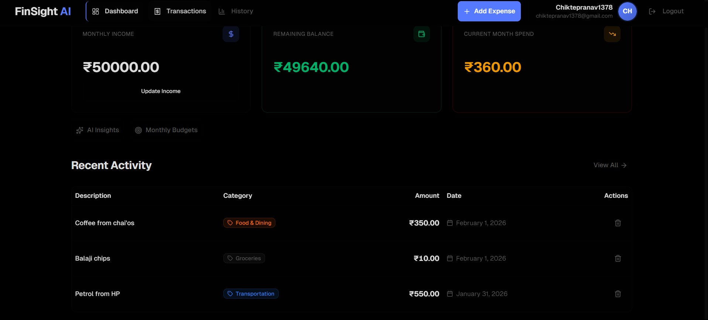
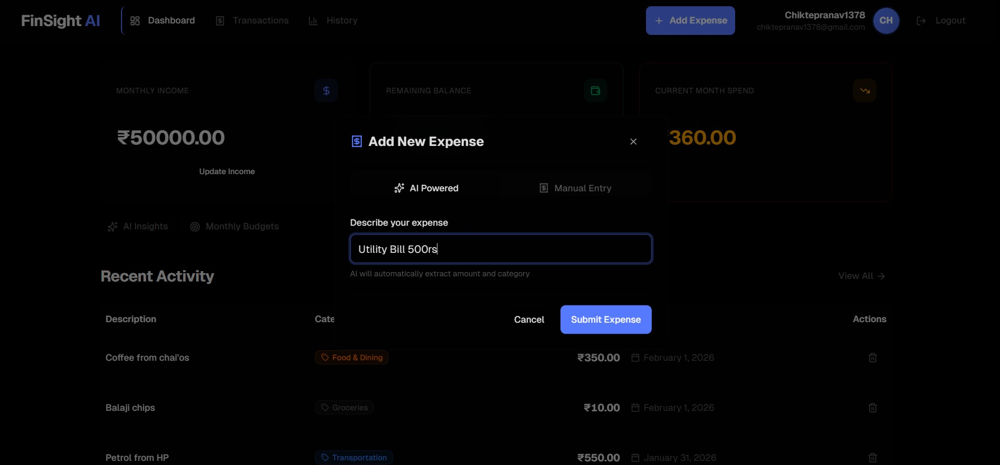
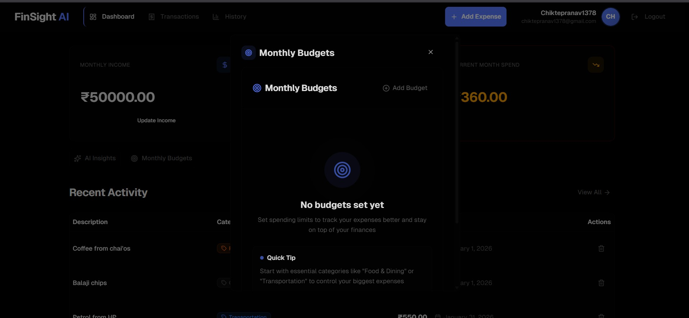
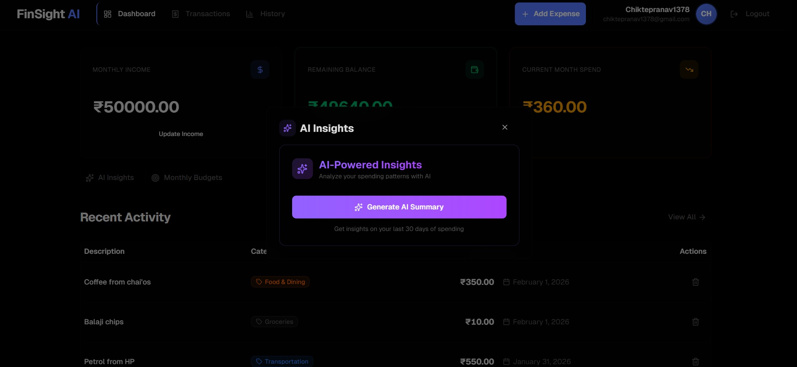

# FinSight AI Frontend


> Modern, responsive React frontend for intelligent expense tracking with AI-powered insights and real-time budget monitoring.

## Live Demo

**Frontend Application:** [https://www.finsightfinance.me](https://www.finsightfinance.me)

**Backend API:** [https://api.finsightfinance.me](https://api.finsightfinance.me)

**API Documentation:** [https://api.finsightfinance.me/api/docs](https://api.finsightfinance.me/api/docs)

---

## Table of Contents

- [About](#about)
- [Tech Stack](#tech-stack)
- [Features](#features)
- [Project Structure](#project-structure)
- [Getting Started](#getting-started)
- [Environment Variables](#environment-variables)
- [Key Components](#key-components)
- [State Management](#state-management)
- [API Integration](#api-integration)
- [Deployment](#deployment)
- [Screenshots](#screenshots)
- [Future Enhancements](#future-enhancements)

---

## About

FinSight AI Frontend is a production-ready React application that provides a seamless user experience for managing personal finances. Built with modern best practices, it features:

- **Intuitive Dashboard**: Real-time overview of spending, budgets, and AI insights
- **Smart Transaction Entry**: Both manual and AI-powered natural language input
- **Budget Tracking**: Visual progress indicators with category-based budgets
- **AI Insights**: Personalized spending analysis and saving tips
- **Responsive Design**: Mobile-first approach for all screen sizes

---

## Tech Stack

| Category | Technology | Version | Purpose |
|----------|------------|---------|---------|
| **Framework** | Next.js | 16.1.2 | React framework with App Router |
| **UI Library** | React | 19.1.0 | Component-based UI |
| **Language** | TypeScript | 5.x | Type safety |
| **Styling** | Tailwind CSS | 4.x | Utility-first CSS |
| **Components** | Radix UI | Latest | Accessible primitives |
| **Charts** | Recharts | 2.15.4 | Data visualization |
| **HTTP Client** | Axios | 1.12.2 | API communication |
| **Icons** | Lucide React | 0.544.0 | Icon library |
| **Animations** | Motion | 12.23.24 | Framer Motion wrapper |
| **Notifications** | Sonner | 2.0.7 | Toast notifications |
| **Analytics** | Vercel Analytics | 1.5.0 | Usage analytics |
| **Fonts** | Geist | 1.5.1 | Modern typeface |

---

## Features

### Authentication
- Secure login with JWT tokens
- Registration with password strength validation
- Password reset flow with email verification
- Automatic token refresh
- Session management

### Dashboard
- Monthly spending overview
- Category-wise expense breakdown (pie chart)
- Recent transactions list
- AI-powered spending insights card
- Budget progress indicators

### Transaction Management
- **Manual Entry**: Add transactions with amount, category, description
- **AI Entry**: Natural language input like "lunch for 500 rupees at cafe"
- Filter by category, date range, amount
- Search transactions
- Delete transactions
- Transaction status tracking (for AI transactions)

### Budget Management
- Create monthly budgets per category
- Real-time spending tracking
- Visual progress bars
- Overspending alerts

### AI Features
- **Smart Parser**: Converts natural language to transactions
- **Spending Summary**: AI-generated monthly insights
- **Saving Tips**: Personalized recommendations

### User Experience
- Loading skeletons for better perceived performance
- Offline detection
- Error handling with user-friendly messages
- Responsive design for mobile/tablet/desktop

---

## Project Structure

```
finsight_ai_frontend/
├── app/
│   ├── layout.tsx              # Root layout with providers
│   ├── page.tsx                # Landing/Login page
│   ├── signup/
│   │   └── page.tsx           # Registration page
│   ├── forgot-password/
│   │   └── page.tsx           # Password reset request
│   ├── reset-password/
│   │   └── page.tsx           # Password reset form
│   ├── dashboard/
│   │   └── page.tsx           # Main dashboard
│   ├── transactions/
│   │   └── page.tsx           # Transaction list
│   └── history/
│       └── page.tsx            # Spending history
│
├── components/
│   ├── ui/                     # Radix UI based components
│   │   ├── button.tsx
│   │   ├── input.tsx
│   │   ├── dialog.tsx
│   │   ├── card.tsx
│   │   ├── table.tsx
│   │   ├── tabs.tsx
│   │   ├── progress.tsx
│   │   └── ...
│   │
│   ├── login-form.tsx         # Login form component
│   ├── signup-form.tsx        # Registration form
│   ├── dashboard-layout.tsx   # Dashboard layout with nav
│   ├── transaction-table.tsx  # Transaction list table
│   ├── transaction-filters.tsx # Filter controls
│   ├── add-expense-modal.tsx  # Add transaction modal
│   ├── add-budget-modal.tsx   # Create budget modal
│   ├── budget-list.tsx        # Budget display
│   ├── stat-card.tsx          # Dashboard stat cards
│   ├── ai-summary-card.tsx   # AI insights display
│   └── ...
│
├── lib/
│   ├── api.ts                 # Axios instance & interceptors
│   ├── types.ts               # TypeScript interfaces
│   ├── utils.ts               # Utility functions
│   └── transaction-utils.ts   # Transaction helpers
│
├── public/
│   └── screenshots/           # App screenshots
│
├── package.json
├── tsconfig.json
├── next.config.ts
├── tailwind.config.ts
└── postcss.config.mjs
```

---

## Getting Started

### Prerequisites

- Node.js 18+
- npm or yarn

### Installation

1. **Clone the repository**
   ```bash
   cd finsight_ai_frontend
   ```

2. **Install dependencies**
   ```bash
   npm install
   # or
   yarn install
   ```

3. **Create environment variables**
   ```bash
   NEXT_PUBLIC_BACKEND_URL=https://api.finsightfinance.me
   ```

4. **Run development server**
   ```bash
   npm run dev
   ```

5. **Open browser**
   Navigate to http://localhost:3000

### Build for Production

```bash
# Create production build
npm run build

# Start production server
npm start
```

---

## Environment Variables

| Variable | Required | Description |
|----------|----------|-------------|
| `NEXT_PUBLIC_BACKEND_URL` | Yes | Backend API base URL |

Create a `.env.local` file:

```env
NEXT_PUBLIC_BACKEND_URL=https://api.finsightfinance.me
```

---

## Key Components

### Authentication Components

| Component | Description |
|-----------|-------------|
| `LoginForm` | Email/password login with validation |
| `SignupForm` | Registration with password strength indicator |
| `ForgotPasswordForm` | Request password reset email |
| `ResetPasswordForm` | Set new password with token |

### Dashboard Components

| Component | Description |
|-----------|-------------|
| `DashboardLayout` | Main layout with sidebar navigation |
| `StatCard` | Displays spending metrics |
| `BudgetList` | Shows budget progress bars |
| `AISummaryCard` | AI-generated insights display |
| `TransactionTable` | Paginated transaction list |
| `CategoryChart` | Pie chart of spending by category |

### Modal Components

| Component | Description |
|-----------|-------------|
| `AddExpenseModal` | Add manual or AI transaction |
| `AddBudgetModal` | Create new budget |
| `SetIncomeModal` | Set monthly income |

---

## State Management

### Client-Side State

- **LocalStorage**: JWT tokens (access, refresh)
- **React State**: Form inputs, UI state
- **Server State**: React Server Components for initial data

### Token Management

The API client (`lib/api.ts`) handles:

1. **Request Interceptor**: Attaches JWT to requests
2. **Response Interceptor**: 
   - Handles 401 errors automatically
   - Attempts token refresh
   - Redirects to login on refresh failure
3. **Offline Detection**: Shows offline banner

```typescript
// Token storage
localStorage.getItem("access_token")
localStorage.getItem("refresh_token")
```

---

## API Integration

### Base Configuration

```typescript
const api = axios.create({
  baseURL: process.env.NEXT_PUBLIC_BACKEND_URL,
  timeout: 30000,
})
```

### Authentication Headers

```typescript
config.headers["Authorization"] = `Bearer ${token}`
```

### Endpoints Used

| Endpoint | Method | Purpose |
|----------|--------|---------|
| `/api/auth/login` | POST | User login |
| `/api/auth/register` | POST | User registration |
| `/api/auth/logout` | DELETE | Invalidate tokens |
| `/api/auth/refresh` | POST | Get new access token |
| `/api/auth/profile` | GET/POST | User profile |
| `/api/transactions` | GET/POST | Transactions CRUD |
| `/api/transactions/summary` | GET | Monthly spending |
| `/api/transactions/history` | GET | Daily history |
| `/api/budgets` | GET/POST | Budget management |
| `/api/ai/summary` | POST/GET | AI insights |

---

## Deployment

### Vercel (Recommended)

```bash
# Install Vercel CLI
npm i -g vercel

# Deploy
vercel
```

### Environment Setup on Vercel

1. Connect GitHub repository
2. Add environment variable:
   - `NEXT_PUBLIC_BACKEND_URL` = `https://api.finsightfinance.me`
3. Deploy automatically on push

### Build Output

```
✓ Build completed successfully
✓ Collected static content
✓ Build output size: 156KB (First Load JS: 89KB)
```

---

## Screenshots

### Login Page


### Dashboard


### Transactions


### AI Expense Entry


### Budgets


### AI Insights


---

## Performance Optimizations

- **Server Components**: Reduced client bundle size
- **Code Splitting**: Automatic route-based splitting
- **Image Optimization**: Next.js Image component
- **Font Optimization**: Geist font with swap strategy
- **Lazy Loading**: Components loaded on demand
- **Skeleton Loading**: Better perceived performance

---

## Accessibility

- ARIA labels on interactive elements
- Keyboard navigation support
- Focus management
- Screen reader compatible (Radix UI)
- Color contrast compliance

---

## Future Enhancements

- [ ] Dark mode support
- [ ] PWA capabilities
- [ ] Transaction attachments (receipts)
- [ ] Recurring transactions
- [ ] Export to CSV/PDF
- [ ] Multiple accounts support
- [ ] Investment portfolio tracking
- [ ] Bill reminders
- [ ] Savings goals
- [ ] Spending challenges

---

## License

MIT License - See LICENSE file for details

---

## Contact

**Live Application:** [https://www.finsightfinance.me](https://www.finsightfinance.me)

**Backend API:** [https://api.finsightfinance.me](https://api.finsightfinance.me)

**API Docs:** [https://api.finsightfinance.me/api/docs](https://api.finsightfinance.me/api/docs)

---

## Built With


---

## Acknowledgments

- [Radix UI](https://www.radix-ui.com/) for accessible components
- [Lucide](https://lucide.dev/) for beautiful icons
- [Recharts](https://recharts.org/) for data visualization
- [Google Gemini AI](https://gemini.google.com/) for intelligent features
